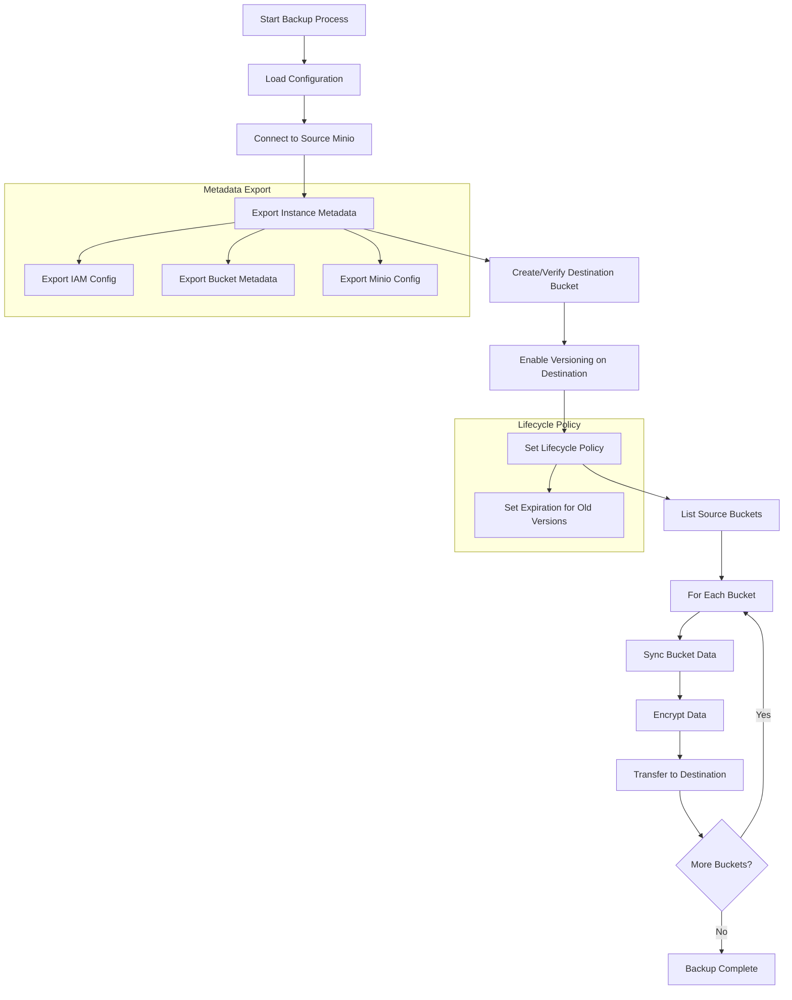
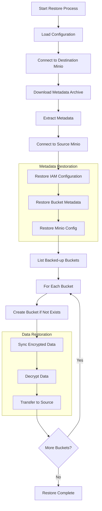

# S32S3 Backup and Restore

S32S3 is a robust tool designed for backing up and restoring data between S3-compatible storage systems, with a focus on Minio instances. It leverages rclone's S3 and crypt backends to ensure secure data transfer and storage.

## Features

- Backup from one S3-compatible storage to another
- Encryption of backed-up data using rclone's crypt backend
- Preservation of bucket metadata, IAM configurations, and Minio settings
- Versioning support and lifecycle management for backups

## Workflow

### Backup Process

### Restore Process

## Configuration and Usage

1. Use the [helm chart](./chart/Chart.yaml) to deploy S32S3 in your Kubernetes cluster.
2. Configure the source and destination S3 endpoints, along with encryption settings, in the `values.yaml` file.
3. For a full restore scenario (e.g., after a Minio instance destruction):
   1. Deploy a new Minio instance
   2. Deploy S32S3 referencing your new minio secret and your backup archive, with `restore.enabled=true`
   3. S32S3 will restore IAM configurations, bucket metadata, and Minio settings
   4. Data from all backed-up buckets will be decrypted and transferred to the new instance

This process allows for a complete recovery from a destroyed Minio instance to a fully restored and operational state.

## Limitations

- It is *impossible* to restore a perfect view of the deleted cluster, along with previous versions of files.
  - The restore process does a point in time restore of the deleted cluster,
    but it *cannot* restore deleted versions of files

## Parameters

### Image Configuration

| Name               | Description                         | Value                 |
| ------------------ | ----------------------------------- | --------------------- |
| `image.name`       | Name of the image                   | `ctr.0x.pt/ops/s32s3` |
| `image.pullPolicy` | Pull policy for the image           | `IfNotPresent`        |
| `image.tag`        | Tag of the image                    | `.Release.appVersion` |
| `imagePullSecrets` | Image pull secrets                  | `[]`                  |
| `nameOverride`     | Override the name of the chart      | `""`                  |
| `fullnameOverride` | Override the full name of the chart | `""`                  |

### Backup

| Name          | Description                      | Value        |
| ------------- | -------------------------------- | ------------ |
| `backup.args` | Args to pass to backup container | `["backup"]` |

### Restore

| Name              | Description              | Value   |
| ----------------- | ------------------------ | ------- |
| `restore.enabled` | Enable restore mode      | `false` |
| `restore.at`      | Restore at specific time | `""`    |

### Configuration

| Name                                   | Description                                                                                                   | Value       |
| -------------------------------------- | ------------------------------------------------------------------------------------------------------------- | ----------- |
| `config.schedule`                      | Cron schedule for backups                                                                                     | `* * * * *` |
| `config.backupBucket`                  | Name of the backup bucket                                                                                     | `backups`   |
| `config.expirationDays`                | Number of days until deleted versions are removed from backups                                                | `7`         |
| `config.extraEnv`                      | Extra environment variables                                                                                   | `{}`        |
| `config.destination.access_key_id`     | Destination access key ID. Using valueFrom referencing the minio secret is recommended for easy restores.     | `{}`        |
| `config.destination.secret_access_key` | Destination secret access key. Using valueFrom referencing the minio secret is recommended for easy restores. | `{}`        |
| `config.destination.endpoint`          | Destination endpoint                                                                                          | `{}`        |
| `config.destination.region`            | Destination region                                                                                            | `{}`        |
| `config.destination.provider`          | Destination provider                                                                                          | `{}`        |
| `config.source.access_key_id`          | Source access key ID                                                                                          | `{}`        |
| `config.source.secret_access_key`      | Source secret access key                                                                                      | `{}`        |
| `config.source.endpoint`               | Source endpoint                                                                                               | `{}`        |
| `config.source.region`                 | Source region                                                                                                 | `{}`        |
| `config.source.provider`               | Source provider                                                                                               | `{}`        |
| `config.crypt.password`                | Encryption password                                                                                           | `{}`        |
| `config.crypt.password2`               | Secondary encryption password                                                                                 | `{}`        |
| `config.rclone`                        | Rclone config <https://github.com/rclone/rclone/blob/v1.68.1/fs/config.go#L534-L638>                          | `{}`        |
| `podAnnotations`                       | Annotations for pods                                                                                          | `{}`        |
| `podLabels`                            | Labels for pods                                                                                               | `{}`        |
| `podSecurityContext`                   | Security context for pods                                                                                     | `{}`        |
| `resources`                            | Resource requests and limits                                                                                  | `{}`        |
| `nodeSelector`                         | Node selector for pods                                                                                        | `{}`        |
| `tolerations`                          | Tolerations for pods                                                                                          | `[]`        |
| `affinity`                             | Affinity for pods                                                                                             | `{}`        |
